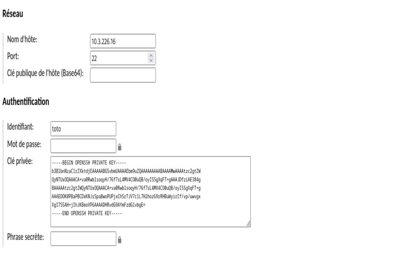

# Lab installation et utilisation d'un bastion ssh
Tp réalisé dans le but d'apprendre le fonctionnement des bastions en autodidacte. 

## Qu'est ce qu'un bastion ssh
Un bastion SSH est un serveur qui sert de passerelle sécurisée pour accéder à d'autres machines dans un réseau privé. Au lieu de se connecter directement aux serveurs internes, les utilisateurs se connectent d'abord au bastion, ce qui permet de mieux contrôler et surveiller les accès.

Plutôt que chaque admins d'une entreprise ait une clé d'accès pour chacun des serveurs, ils ont chacun un compte sur le bastion qui va leur servir d'interface de connexion.

## Apache Guacamole ou The Bastion

### Apache Guacamole
- Dev par Apache
- Nom rigolo
- Très ancien

### The Bastion
- Solution dévellopé par ovh
- Se situe strictement entre vous et le serveur distant (n'utilise pas d'interface web pour le terminal comme Guacamole)

## Comment installer Apache Guacamole
Mise à jour des paquets et installation des dépendances :
```
apt-get update
apt-get install build-essential libcairo2-dev libjpeg62-turbo-dev libpng-dev libtool-bin uuid-dev libossp-uuid-dev libavcodec-dev libavformat-dev libavutil-dev libswscale-dev freerdp2-dev libpango1.0-dev libssh2-1-dev libtelnet-dev libvncserver-dev libwebsockets-dev libpulse-dev libssl-dev libvorbis-dev libwebp-dev
```

Téléchargement et installation de Guacamole Server :
```
cd /tmp
wget https://downloads.apache.org/guacamole/1.5.5/source/guacamole-server-1.5.5.tar.gz
tar -xzf guacamole-server-1.5.5.tar.gz
cd guacamole-server-1.5.5/
sudo ./configure --with-systemd-dir=/etc/systemd/system/
sudo make
sudo make install
sudo ldconfig
sudo systemctl daemon-reload
sudo systemctl enable --now guacd
sudo systemctl status guacd
```

Configuration de Tomcat pour Guacamole :
```
sudo mkdir -p /etc/guacamole/{extensions,lib}
sudo echo "deb http://deb.debian.org/debian/ bullseye main" >> /etc/apt/sources.list.d/bullseye.list
sudo apt-get update
sudo apt-get install tomcat9 tomcat9-admin tomcat9-common tomcat9-user
cd /tmp
wget https://downloads.apache.org/guacamole/1.5.5/binary/guacamole-1.5.5.war
sudo mv guacamole-1.5.5.war /var/lib/tomcat9/webapps/guacamole.war
sudo systemctl restart tomcat9 guacd
```

Installation de MariaDB et configuration de la base de données :
```
sudo apt-get install mariadb-server
sudo mysql_secure_installation
mysql -u root -p
```

Création de la base de données et utilisateur pour Guacamole :
```
CREATE DATABASE guacadb;
CREATE USER 'guaca_nachos'@'localhost' IDENTIFIED BY 'P@ssword!';
GRANT SELECT,INSERT,UPDATE,DELETE ON guacadb.* TO 'guaca_nachos'@'localhost';
FLUSH PRIVILEGES;
EXIT;
```

Installation de l'extension JDBC pour Guacamole (MySQL) :
```
cd /tmp
wget https://downloads.apache.org/guacamole/1.5.5/binary/guacamole-auth-jdbc-1.5.5.tar.gz
tar -xzf guacamole-auth-jdbc-1.5.5.tar.gz
sudo mv guacamole-auth-jdbc-1.5.5/mysql/guacamole-auth-jdbc-mysql-1.5.5.jar /etc/guacamole/extensions/
cd /tmp
wget https://dev.mysql.com/get/Downloads/Connector-J/mysql-connector-j-9.1.0.tar.gz
tar -xzf mysql-connector-j-9.1.0.tar.gz
sudo cp mysql-connector-j-9.1.0/mysql-connector-j-9.1.0.jar /etc/guacamole/lib/
```

Exécution des scripts SQL pour configurer la base de données :
```
cd guacamole-auth-jdbc-1.5.5/mysql/schema/
cat *.sql | mysql -u root -p guacadb
```

Configuration des propriétés de Guacamole pour MySQL :
```
sudo nano /etc/guacamole/guacamole.properties
# MySQL
mysql-hostname: 127.0.0.1
mysql-port: 3306
mysql-database: guacadb
mysql-username: guaca_nachos
mysql-password: P@ssword!
```

Configuration du serveur Guacamole :
```
sudo nano /etc/guacamole/guacd.conf
[server] 
bind_host = 0.0.0.0
bind_port = 4822
```

Redémarrage des services :
```
sudo systemctl restart tomcat9 guacd mariadb
```

-> http://ip:8080/guacamole/

- On crée un nouveau compte admin
- On s'y connect
- On supprime le compte crée de base (guacadmin)

## Coté machine cible
Coté machine cible je suis partie sur un Ubuntu minimal et j'ai simplement installer un server SSH dessus.

```
apt-get install openssh-server
```

Depuis le bastion on va générer une paire de clés :
```
ssh-keygen -t ed25519
Generating public/private ed25519 key pair.
Enter file in which to save the key (/home/toto/.ssh/id_ed25519):
Enter passphrase (empty for no passphrase):
Enter same passphrase again:
Your identification has been saved in /home/toto/.ssh/id_ed25519
Your public key has been saved in /home/toto/.ssh/id_ed25519.pub
```

On copie la clé publique sur la machine cible
```
ssh-copy-id -i id_ed25519.pub toto@10.3.226.16
/usr/bin/ssh-copy-id: INFO: Source of key(s) to be installed: "id_rsa.pub"
/usr/bin/ssh-copy-id: INFO: attempting to log in with the new key(s), to filter
out any that are already installed
/usr/bin/ssh-copy-id: INFO: 1 key(s) remain to be installed if you are prompt
ed now it is to install the new keys
toto@10.3.226.16's password:

Number of key(s) added: 1

Now try logging into the machine, with: "ssh 'toto@10.3.226.16'"
and check to make sure that only the key(s) you wanted were added.
```
*C'est l'unique fois ou on va utiliser un mot de pass pour ce connecter au ssh*

On test si ça fonctionne :
```
ssh toto@10.3.226.16
Welcome to Ubuntu 24.04.1 LTS (GNU/Linux 6.8.0-50-generic x86_64)
```

Super ! On peu maitenant crée un nouvelle connexion sur le bastion.

On met la clé privée correspondante à la clé publique qu'on a envoyé à la machine cible :



La connexon fonctionne depuis l'interface web du bastion.

On desactive l'auth par mot de passe pour ssh sur la machine client :
```
cat /etc/ssh/sshd_config | grep PasswordAuth
PasswordAuthentication no
systemctl restart ssh
```

Et on autorise que l'ip de notre bastion sur le parefeu :
```
sudo ufw default deny incoming

sudo ufw allow from 10.3.209.216 to any port 22
```

## Conclusion
Utilisez des bastions c'est bien.

C👽rambole.